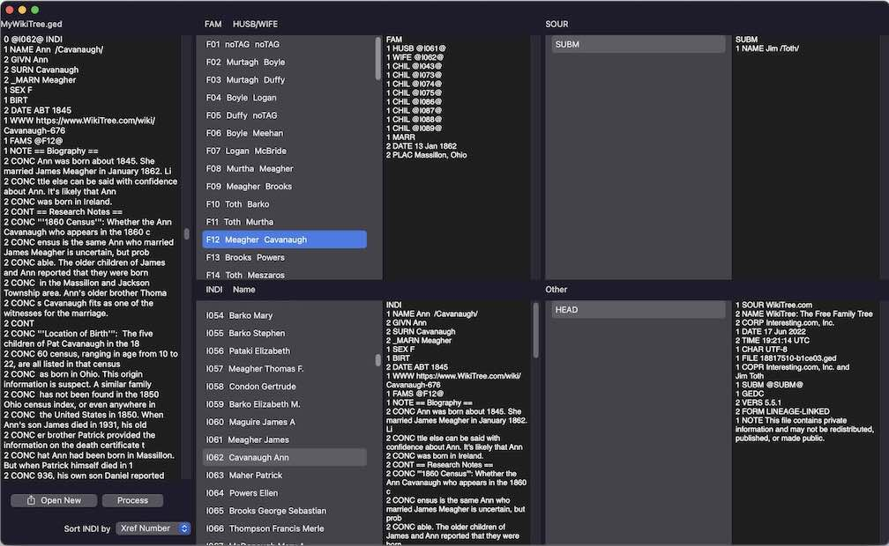

## GEDCOM Browser:

For manually browsing a GEDCOM file.

### Description

An Xcode project. The project name is *GDReaderSUI*, because the current version was updated to use SwiftUI. This macOSapp is not a GEDCOM parser, though a small amount of parsing is done. The app separates the GEDCOM file into records, then makes the contents of the records available in master-detail (navigation) views. This facilitates browsing the file. For example, links can be easily followed from a family record to individual records, and back.

### Motivation

GEDCOM is a standard for exchanging genealogical information. The standard is generally understood to be intended for output from one computer program, then input to another computer program. However the GEDCOM file is plain text, and reading it that way can reveal details output by the generating program but not understood by an ingesting program. My previous version of this reader was over 15 years old, and that version had been using a number of deprecated features. I wanted to learn how to use SwiftUI. Suggestions are welcome for better ways to do things. The starting point for this version was the simple text editor in the SaveAndOpenPanelsSwiftUI project by Gabriel Theodoropoulos at https://serialcoder.dev.

### Using

On startup, most of the views are already populated with data from a placeholder GEDCOM file. Clicking the "Process" button will add the spouse surnames from that file. "Open New" will place the contents of a selected file into the left column. "Process" will then separate that file into records which are displayed in the grid of four navigation views on the right. An individual can be located by choosing to sort by Surname. Families linked to that individual can then be selected in the view above. Links to other individuals can be followed by selecting to sort by XRef Number.
The parsing of names is crude, meant only as an aid in following links back and forth betweeen individuals and families.

### Architectural Details

I deliberately use the `.constant` version of the TextEditor initializers. The views then provide convenient scrolling and copying and pasting elsewhere. If editing and saving were included, this would be starting to duplicate the functioning of the long-existing [Lifelines program](http://lifelines.sourceforge.net) ([latest version](https://github.com/lifelines/lifelines/releases/tag/3.1.1)).

### Requirements

Works on current (July 2022) versions of macOS and Xcode. Compatability with earlier or later versions unknown.

