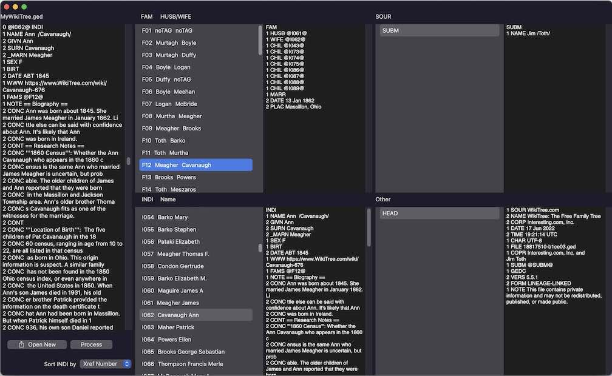

## GEDCOM Browser:

For manually browsing a GEDCOM file.

### Description

An Xcode project. The project name is *GDReaderSUI*, because the old version was updated to use SwiftUI. This macOS app is not a GEDCOM parser, though a small amount of parsing is done. The app is simply intended to facilitate browsing the GEDCOM file. Links can be easily followed from a family record to an individual record, and back, and to source and other records.

### Motivation

GEDCOM is a standard for exchanging genealogical information. The standard is generally understood to be intended for output from one computer program, then input to another computer program. However the GEDCOM file is plain text, and reading it that way may be the only way to see details output by the generating program that were not understood, thus ignored or garbled, by an ingesting program. My previous version of this reader was over 15 years old, and that version had been using a number of deprecated features. I wanted to try to get comfortable with SwiftUI. Suggestions are welcome for better ways to do things. The starting point in 2022 for this version was the simple text editor in the SaveAndOpenPanelsSwiftUI project by Gabriel Theodoropoulos at https://serialcoder.dev.

### Using

On startup, the four master-detail views on the right are mostly already populated with data from a placeholder GEDCOM file. Clicking the "Process" button will add the spouse surnames to the lone placeholder family. "Open New" will place the contents of a selected file into the left column. "Process" will then separate that file into records which are displayed in the grid of four master-detail views on the right. An individual can be located by choosing to sort by Surname. Families linked to that individual can then be selected in the family view above. Links to other individuals can be followed by selecting to sort by XRef Number.

### Architectural Details

A GEDCOM document is a text file composed of a header, a number of records, and a trailer. That file labels the records with unique cross-reference identifiers. This program, via file ContentView, when the Process button is clicked crudely parses the document and presents four lists of the cross-reference identifiers. In each of those lists a cross-reference can be selected, and a detail view then reveals the remainder of the record content. Everything in the document is contained in one of the four arrays: families (Family records), individuals (Individual records), sources (Source records), and other (all other records, plus the header). The TRLR tag simply gets appended to the content of the last record.

Additionally there is a crude parsing of names in the Individual records, meant only as an aid in following links back and forth between individuals and families. The information is included with the listings of cross-references of families and individuals.

For each TextEditor detail view I deliberately use the `.constant` version of the initializer. The view then provides convenient scrolling, with optional copying and pasting elsewhere. If editing and saving of the GEDCOM file were to be included, that would be starting to duplicate the long-existing [Lifelines program](http://lifelines.sourceforge.net) ([latest version](https://github.com/lifelines/lifelines/releases/tag/3.1.1)).

There is no requirement that the cross-reference identifiers for Family, Individual, and Source records begin with the letters F, I and S respectively. Assuming as a shortcut that convention; would be safer to check for the record type. A properly formatted GEDCOM file could be devised that would break this assumption; the records would still be separated and probably all end up in the others bin. All GEDCOM files I've viewed follow the F I S convention. There are other conventions I've assumed even though they have been made requirements only in the latest [GEDCOM specification](https://gedcom.io/specs/). A separate text editor could be used to repair an outlier file that does not follow conventions.

Originally, in 2022, I made each of the four panels on the right a NavigationView. Now, in January 2024, I tried to replace these with NavigationSplitViews, but discovered that more than one crashes. So the four panels are now implemented as DIY master-detail views.

### Requirements

Works on current (January 2024) versions of macOS and Xcode. Compatability with earlier or later versions unknown.

